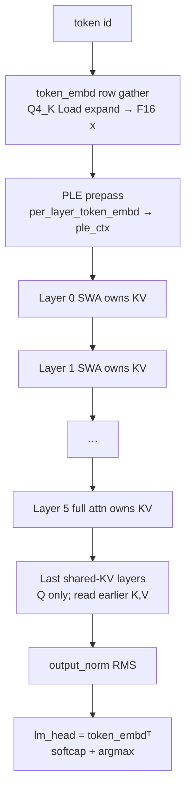
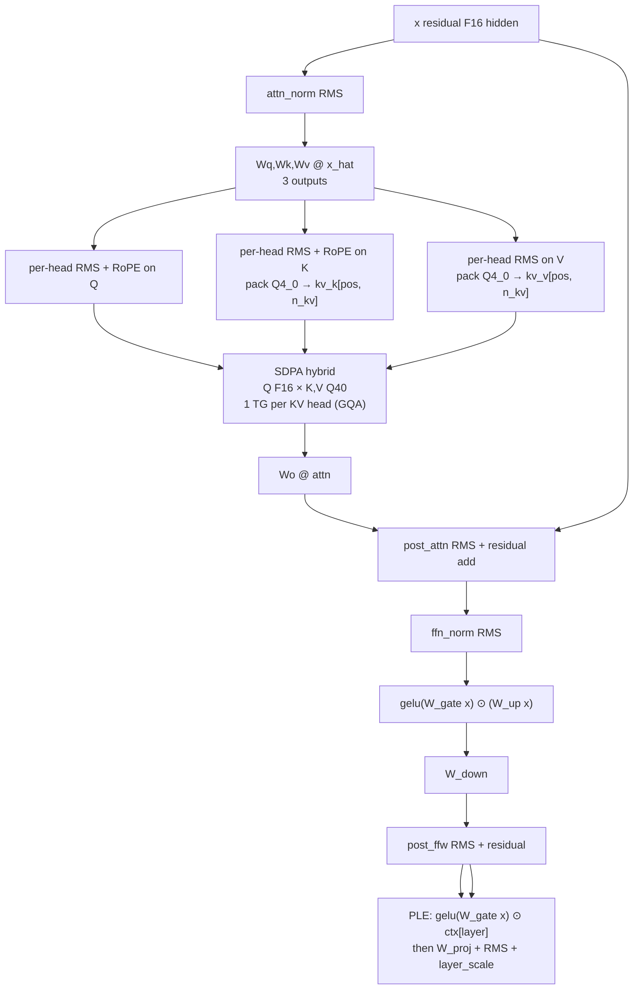
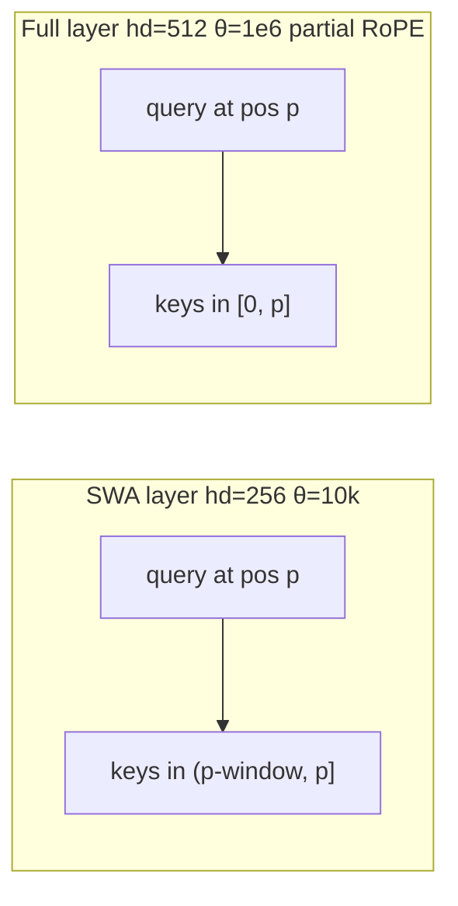
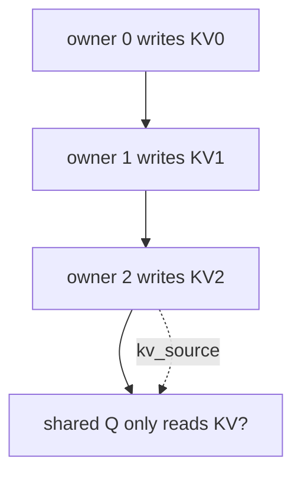
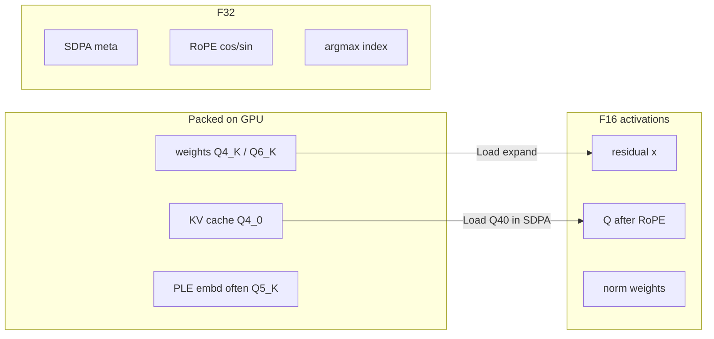
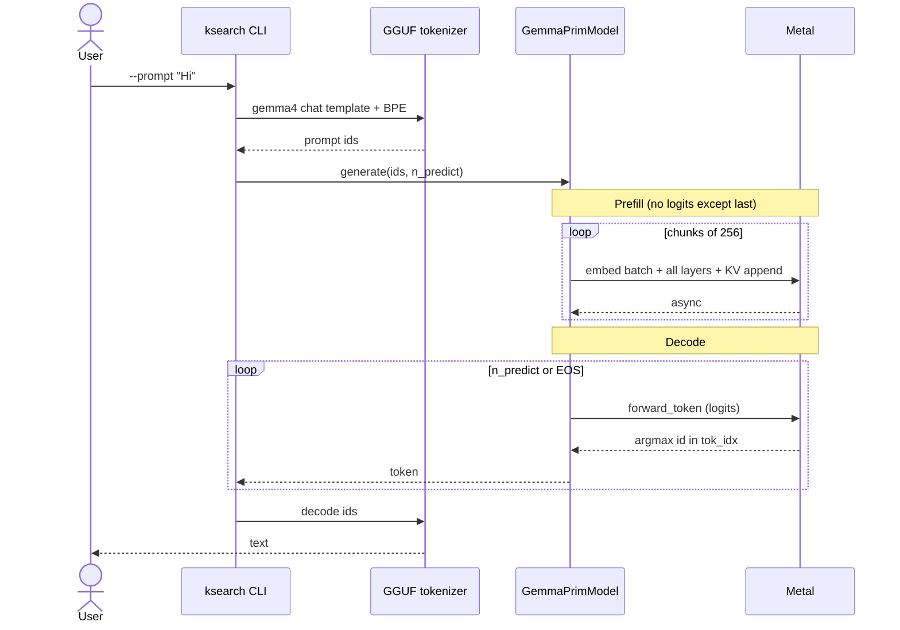
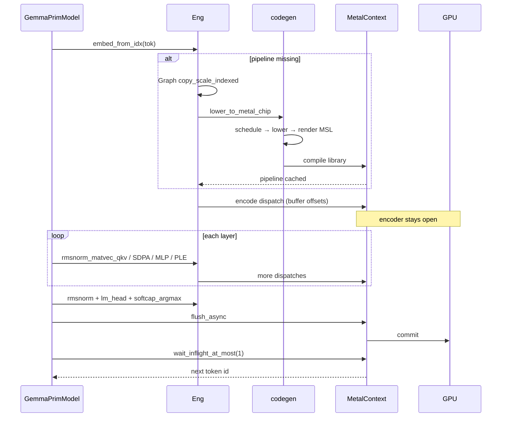
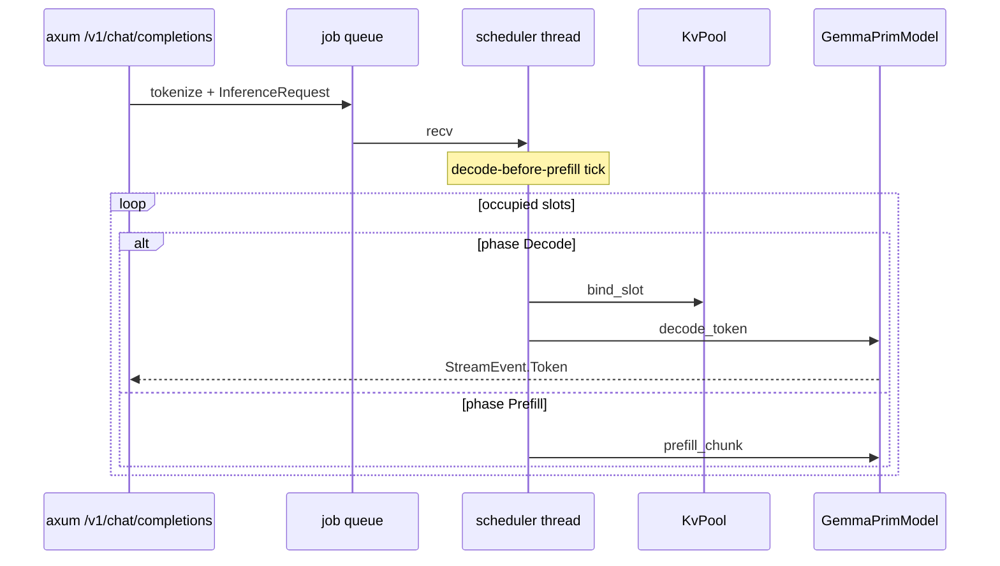

# 0c. Gemma 4 architecture

Vanilla decoder (previous chapter) plus dense Gemma 4 specifics that ksearch actually runs (**E2B** and **E4B**). Numbers come from GGUF metadata (`GemmaConfig`); the diagrams below use E2B-shaped counts as a teaching default. E4B is the same family with larger hidden size and **GQA** (`n_kv > 1`). MoE A4B is not supported.

Watch: Manim scenes `Gemma4Stack`, `GemmaLayer`, `DecodeTokenSeq` ([animations](./animations/README.md)). Runtime details: [07-gemma-runtime.md](./07-gemma-runtime.md).

## Whole-model block diagram



Tied embeddings: `token_embd.weight` is both the lookup table and the lm_head matrix.

## One layer (owner)

This is the block `forward_token` runs for a layer that **writes** KV.



Non-owners skip K/V projections and pack; they still run Q, SDPA against `kv_source(layer)`’s cache, then MLP + PLE.

## Sliding window vs full attention

Default pattern: `(layer + 1) % 6 != 0` → SWA; every 6th layer is **full**.



- SWA: cheap attention, local context, smaller head dim.
- Full: global context, larger `hd`, only a prefix of dims get RoPE (`partial_rotary = 0.25`).

`meta` buffer per layer: `(tlen, start)` so the SDPA kernel does not recompile when `pos` changes.

## Shared KV

Last `shared_kv_layers` layers do not allocate K/V. They reuse the nearest earlier owner with the same SWA/full type.



## PLE (per-layer embedding)

Not in a vanilla GPT block. Each token has an extra embedding used **inside every layer**:

```text
u = gelu(W_inp_gate @ x) ⊙ ple_ctx[layer]     # ple_dim (e.g. 256)
x = layer_scale * (x + RMSNorm(W_proj @ u))
```

`ple_ctx` is computed once per token (prepass) from `per_layer_token_embd`. Skip this and E2B-it will fail the `"Hi"` gate even if attention is perfect.

## Data types on the wire



## Sequence: `generate(prompt, n_predict)`



## Sequence: one decode token (compiler + GPU)



The **first** time a unique `(op, shape, dtype)` runs, you pay MSL compile. Later tokens hit `Eng`’s `HashMap`.

## Sequence: serving (`ksearch serve`)



GPU work is **serial** (one model, shared `x` scratch). Parallelism is **N KV slots** in memory.

## Map onto code

| Diagram box | Code |
|-------------|------|
| Embed gather | `Eng::copy_scale_indexed_wd` |
| PLE prepass | `ple_prepass` in `gemma_prim.rs` |
| QKV + RMS | `Eng::rmsnorm_matvec_qkv_wds` |
| Pack KV | `Eng::rmsnorm_per_head_qkv_q40_off` |
| SDPA | `Eng::sdpa_hybrid_kv` |
| MLP | `matvec_gate_up_gelu_wd` |
| PLE residual | `matvec_gelu_mul_at` + `matvec_rmsnorm_add_scale` |
| lm_head | `matvec_wd` on `token_embd` |
| Sample | `softcap_argmax` or `sample_softcap_min_p` |

## Checkpoint

Explain to a rubber duck, without notes:

1. Why decode is matvecs, not matmuls.
2. What SWA changes in the SDPA loop bound.
3. Why shared-KV layers still run Q and SDPA.
4. Why PLE is required for the Hi gate.
5. Why the Metal encoder stays open for a whole token.

Then start the compiler path: [01-mental-model.md](./01-mental-model.md).
