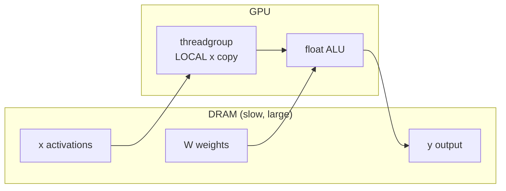
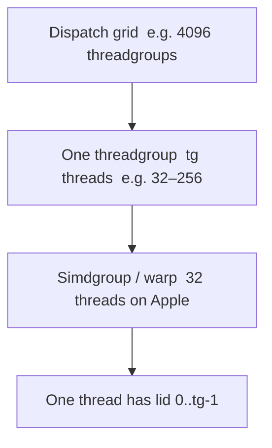
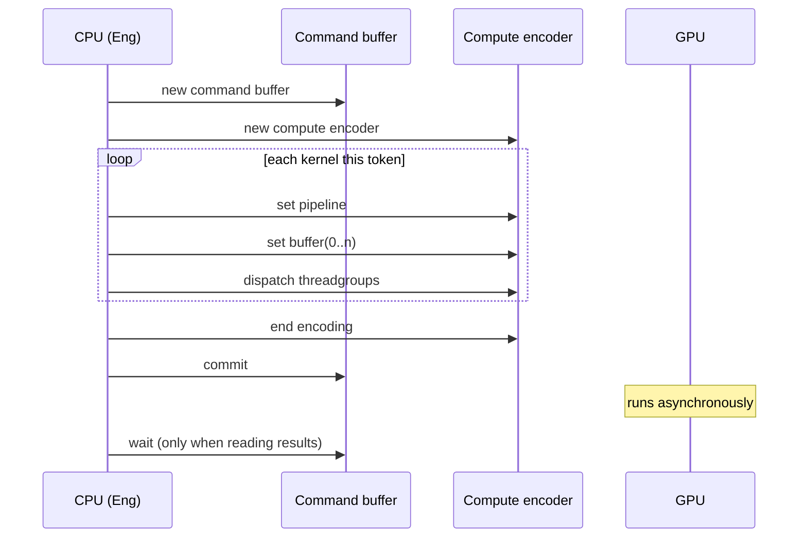

# 0b. Metal basics

ksearch’s target is **Metal Shading Language (MSL)** on Apple GPUs. You do not need graphics (vertices, textures). Think: C++ functions that run thousands of times in parallel, each with an index, reading/writing **buffers**.

Watch: Manim scene `MetalDispatch` ([animations](./animations/README.md)).

## CPU vs GPU for a matvec

`y[r] = Σ_c W[r,c] * x[c]` for `rows=4096`, `cols=4096`:

- **CPU:** one (or a few) cores, excellent caches, sequential-friendly.
- **GPU:** thousands of tiny cores. Wins when many threads do the same math on different data (**SIMT**).

Decode is often **memory bound**: you stream `W` (hundreds of MB) once per token to produce a 1536-vector. FLOPs are cheap; bytes from DRAM are not. Good kernels reuse `x` from fast memory (threadgroup / registers) while streaming `W`.



## The objects you will touch

| Object | Role in ksearch |
|--------|-----------------|
| `MTLDevice` | The GPU (`MetalContext::new`) |
| `MTLCommandQueue` | Submits work |
| `MTLBuffer` | A byte array visible to GPU (and, on Apple Silicon, to CPU — **shared** storage) |
| `MTLLibrary` | Compiled MSL (`new_library_with_source`) |
| `MTLComputePipelineState` | One kernel function, ready to dispatch |
| Command buffer + compute encoder | A recording of “bind these buffers, launch this grid” |

Apple Silicon: CPU and GPU share memory. `StorageModeShared` means `buf.contents()` on the CPU is the same bytes the GPU writes. That is why `read_f32` works without an explicit download.

## A kernel is a C++ function

```metal
#include <metal_stdlib>
using namespace metal;

kernel void k_add(
  device const float* a [[buffer(0)]],
  device const float* b [[buffer(1)]],
  device float* out [[buffer(2)]],
  uint gid [[thread_position_in_grid]]
) {
  if (gid >= 1048576u) return;
  out[gid] = a[gid] + b[gid];
}
```

- `kernel` — entry point for compute (not a vertex shader).
- `device` — pointer into a buffer in GPU address space.
- `[[buffer(n)]]` — bind slot. Eng binds input 0, 1, … then outputs.
- `[[thread_position_in_grid]]` — this thread’s global index (`gid` in Kernel IR).

ksearch **generates** this string from an AST. You still have to understand it when Metal’s compiler errors.

## Threads, threadgroups, simdgroups



| Index | Metal attribute | Kernel IR | Typical use |
|-------|-----------------|-----------|-------------|
| `gid` | `thread_position_in_grid` **or** `threadgroup_position_in_grid` | `KirExpr::Gid` | Which output row / element |
| `lid` | `thread_index_in_threadgroup` | `KirExpr::Lid` | Which lane in a reduction |
| simd lane | `thread_index_in_simdgroup` | derived | Q4 coop (32 lanes) |

**Elementwise add:** one thread per element; `gid` is the element; no communication.

**Matvec:** one **threadgroup per output row** (or per `nr0` rows). Threads split the `cols` loop, then **reduce** their partial dots:

```text
partial = 0
for c = lid, lid+tg, …, cols:
    partial += W[row, c] * x[c]
acc = threadgroup_reduce(partial)   # simd_sum when tg ≤ 32
if lid == 0: y[row] = acc
```

`simd_sum` is a hardware shuffle inside 32 threads. Larger TG uses LOCAL memory + `threadgroup_barrier`.

**Threadgroup (LOCAL) memory:** `threadgroup float tg0[1536]` — fast, shared by the TG, gone when the TG finishes. ksearch stages `x` here so every row does not re-read activations from DRAM (`TgDeclF32`, `Barrier`).

## Command encoding (sequence)



ksearch keeps the encoder **open for a whole decode token** (`pending` in `MetalContext`): RMSNorm, matvecs, SDPA, MLP are many dispatches, one commit. Waiting every kernel would destroy tok/s.

`flush_async` = commit, do not wait. `synchronize` = wait. `wait_inflight_at_most(1)` = allow one token of overlap.

## Launch sizes

The host must pick:

- **threads per threadgroup** (`tg`) — e.g. 256 for elementwise, `nsg*32` for Q4 coop
- **number of threadgroups** — e.g. `rows / nr0` for matvec

If these disagree with what the MSL assumes, you get wrong answers or GPU faults. `LaunchHint` on `MetalKernelSource` is how Eng and the renderer stay in sync.

## F16 and packed types

ALU in generated kernels is **float**. Buffers may be:

- `device const half*` — `float(a[i])` on load, `half(v)` on store
- `device const uchar*` — Q4_K bytes; `ksearch_load_q4k(A, idx)` returns float

That promotion is **Load expand** in the renderer, not a different programming model.

## Fast math

`MetalContext::compile` enables fast math (`metal` compile options). `rsqrt`, `tanh`, fused mul-add may be slightly inexact. That is normal; check RMS/matvec with a loose tolerance (F16), not bit-identical F32.

## Mental model for ksearch

```text
You write Graph math
  → compiler prints MSL like the k_add kernel
  → Metal compiles to GPU ISA
  → Eng binds MTLBuffers and dispatches
```

You never call `device.new_compute_pipeline` with a hand-written `.metal` file on the hot path. The **ideas** in this chapter (gid, TG reduce, LOCAL `x`, one encoder per token) are exactly what `lower.rs` + `MetalContext` implement.

Next: [00-gemma-architecture.md](./00-gemma-architecture.md) or, if you already know Gemma, [01-mental-model.md](./01-mental-model.md).
