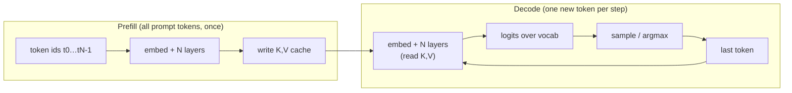
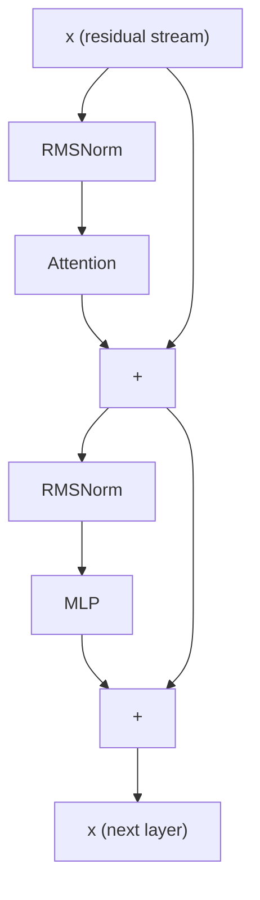
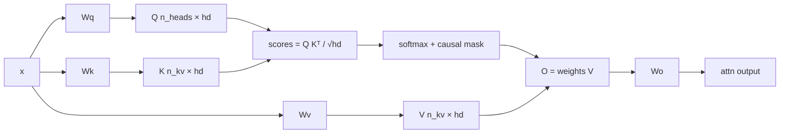
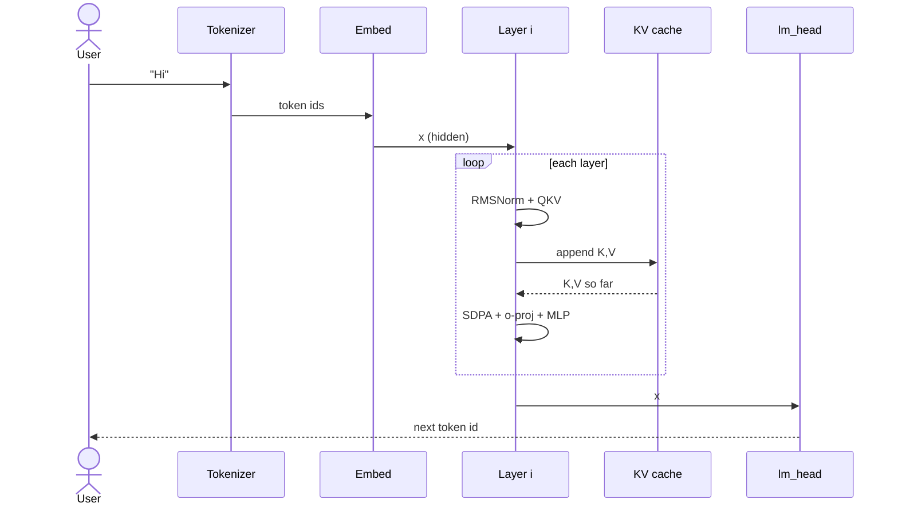

# 0a. Transformer basics

This is the neural-net picture ksearch implements. No compiler yet. After this chapter you should be able to draw one decoder block and explain prefill vs decode.

Watch: Manim scene `TransformerBlock` and `SdpaNaive` ([animations](./animations/README.md)). Interactive: [ksearch basics canvas](/Users/PRADEEP.BORADO/.cursor/projects/Users-PRADEEP-BORADO-Documents-misc-ksearch/canvases/ksearch-basics.canvas.tsx).

## What an LLM is doing

A decoder-only transformer turns a list of token ids into a distribution over the **next** token, then samples, appends, and repeats.



- **Prefill:** many tokens, can batch matmuls. Fills the KV cache.
- **Decode:** batch size 1. Each layer is mostly **matvec** (`W @ x` for one column `x`). This is why decode is weight-bandwidth bound, not FLOP bound.

ksearch’s `generate` does exactly this split (`prefill_chunk` then `decode_token`).

## Tokens and embeddings

Text is not fed as characters. A tokenizer maps `"Hi"` → ids such as `[2, 1234, …]`. An **embedding table** is a matrix `token_embd[vocab, hidden]`. Token id `i` selects row `i`:

```text
x = token_embd[i]     # vector of length hidden (E2B: 1536)
```

Gemma 4 ties this table to the **lm_head**: the same weights turn the final hidden state into vocab logits (`logits = token_embd @ x`). In ksearch that is a huge Q4_K matvec.

## The residual stream

Every layer reads and writes a vector `x` of length `hidden`. Blocks **add** their output; they do not replace `x`. That skip connection is the residual:

```text
x = x + Attention(RMSNorm(x))
x = x + MLP(RMSNorm(x))
```



If you omit a `+`, generation explodes or collapses. Gemma 4 adds extra norms (post-attn, post-MLP) and a **PLE** residual; see [00-gemma-architecture.md](./00-gemma-architecture.md).

## RMSNorm

LayerNorm subtracts the mean. **RMSNorm** only uses the root-mean-square (Gemma, LLaMA, …):

```text
rms(x) = sqrt(mean(x²) + eps)
y      = (x / rms(x)) * w
```

tinygrad / ksearch expand this to primitives: square → sum → scale → add eps → rsqrt → mul. `w` is a learned vector of length `hidden` (or `hd` for per-head norms).

## Attention (the important loop)

For one query vector `q` of length `hd`, and cached keys/values `K,V` of shape `[tlen, hd]`:

```text
scores[t] = (q · K[t]) / sqrt(hd)
weights   = softmax(scores)          # causal: t ≤ current position
o         = Σ_t weights[t] * V[t]
```



**Causal mask:** position `p` may only look at keys `0…p` (and, for sliding window, only the last `W` of those).

**GQA / MQA:** many Q heads share fewer K/V heads. Gemma 4 E2B is typically **MQA** (`n_kv = 1`): one K and one V stream, all Q heads share it. That is a bandwidth win when reading the KV cache.

**RoPE:** rotate pairs of dimensions in Q and K by an angle that depends on position, so the dot product encodes relative distance. Implemented as `cos/sin` tables, not as a learned matrix.

**KV cache:** after computing K and V for the new token, **append** them. Next step only computes Q (and new K,V for this token), then attends over the whole cache. Without a cache you would redo all past K,V every token.

ksearch stores KV as **Q4_0** packs and loads them with `Load(Q40)` inside SDPA.

### Softmax numerically

Naive `exp(s) / sum(exp(s))` overflows. **Online softmax** tracks running max `m` and sum `l` while streaming `t`, which is what `lower_sdpa_online` does. Partitioned MWG (long context) runs several online passes and merges.

FlashAttention is a *different algorithm* (tiling + online softmax in SRAM). ksearch generates the naive/MWG AST, not Flash.

## MLP (feed-forward)

Gemma uses a gated GELU MLP (same family as LLaMA SwiGLU, with GELU instead of SiLU):

```text
h = gelu(W_gate @ x) ⊙ (W_up @ x)
y = W_down @ h
```

`gelu` (tanh approx): `0.5 * x * (1 + tanh(0.797885 * (x + 0.044715 * x³)))`.

`W_gate` and `W_up` are the big decode matvecs. ksearch fuses them into one kernel (`MatvecGateUpGelu`) so `x` is staged once.

## Logits and sampling

After the last layer:

```text
h = RMSNorm(x, output_norm)
logits = token_embd @ h          # vocab × hidden
logits = cap * tanh(logits / cap)  # Gemma softcap
next   = argmax(logits)            # greedy; or temperature sample
```

Vocab is huge (~262k). That lm_head matvec is often the slowest single kernel in decode.

## Sequence: one training-free forward (what you will code)



## Checkpoint

On paper, write shapes for one decode step given `hidden=1536`, `n_heads=8`, `hd=256`, `n_kv=1`, `tlen=10`, `vocab=262144`:

| Tensor | Shape |
|--------|--------|
| `x` | `[1536]` |
| `Q` | `[8, 256]` |
| `K,V` (new) | `[1, 256]` |
| `K,V` (cache) | `[10, 256]` |
| `O` | `[8, 256]` |
| `logits` | `[262144]` |

Then read [00-metal.md](./00-metal.md) (how a matvec runs on GPU) and [00-gemma-architecture.md](./00-gemma-architecture.md) (what Gemma 4 adds on top of this vanilla block).
