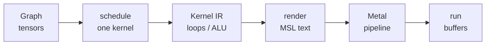

# 1. Mental model

ksearch is a **compiler whose source language is a tensor graph** and whose target is **Metal Shading Language (MSL)** running on an Apple GPU. The “program” is one transformer forward pass. The compiler’s job is to turn math into GPU kernels without you pasting those kernels by hand.

If transformers, Metal, or Gemma 4 are new, read [00-transformers.md](./00-transformers.md), [00-metal.md](./00-metal.md), and [00-gemma-architecture.md](./00-gemma-architecture.md) first (block + sequence diagrams). Render the matching Manim scenes from [animations/README.md](./animations/README.md).

If you have used PyTorch, you already know the *eager* version of this: `y = W @ x` runs a cuBLAS gemv. ksearch is the *lazy compiler* version: you record `y = sum(W * x, axis=1)`, a scheduler decides that is one kernel, a lowerer builds a loop AST, a renderer prints MSL, Metal compiles it, you launch it.

## Why a compiler, not a shader folder

Hand-written LLM servers (llama.cpp Metal, MLX, `reference/metal-llm-server`) win on tok/s because experts wrote fused kernels. That is a valid product. It is a different product.

ksearch’s bet (Thesis A):

- The **math** of Gemma is stable and small: add, mul, reduce, reshape, a few fused regions.
- The **kernels** should be a function of that math plus a **schedule** (how to tile loops).
- Search (BEAM) can retune tiles per chip without rewriting shaders.

What search does **not** do: invent FlashAttention. FlashAttention is a different algorithm (online softmax + SRAM tiling), not a tiling of naive `softmax(QKᵀ)V`. [FINDINGS.md](./FINDINGS.md) is honest about this. ksearch generates naive / partitioned-MWG SDPA from the AST and measures the gap.

## The six boxes



```
  Graph          schedule         Kernel IR         render          Metal         run
 (tensors)   →  (one kernel)  →  (loops/ALU)  →  (MSL text)  →  (pipeline)  →  (buffers)
```

| Box | Lives in | Input | Output |
|-----|----------|-------|--------|
| **Graph** | `ksearch_ir` | You calling `g.add`, `g.rmsnorm_expand`, `g.matvec_prim` | A DAG of `Op` nodes + optional `FuseHint` |
| **Schedule** | `ksearch_codegen::schedule` | A root `TensorId` | One `ScheduledKernel` (`KernelKind`) |
| **Lower** | `ksearch_codegen::lower` | `KernelKind` + `OptSchedule` | `KernelIr` (`KirStmt` / `KirExpr`) |
| **Render** | `ksearch_codegen::render` | `KernelIr` | `MetalKernelSource` (string + launch hint) |
| **Compile** | `ksearch_metal` | MSL string | `MTLComputePipelineState` |
| **Eng** | `ksearch_kernels` | Shapes + Metal buffers | Cached pipelines + encoded dispatches |

`GemmaPrimModel` never writes MSL. For each op it asks `Eng`, which builds a tiny Graph, calls `lower_to_metal_chip`, compiles once, and reuses the pipeline.

## Tinygrad map (why the IR looks like this)

Study `reference/tinygrad`. The important split:

| Layer | tinygrad | ksearch |
|-------|----------|---------|
| Sugar | `Tensor.matmul`, `nn.RMSNorm`, `scaled_dot_product_attention` | `Graph::matvec_prim`, `rmsnorm_expand`, `sdpa_naive` |
| Real IR | UOp: `ADD`/`MUL`/`REDUCE`/`LOAD`/`STORE`/`RESHAPE`/… | `Op::Add`/`Mul`/`SumReduce`/`Load` in Kernel IR |
| Kernel boundary | Scheduler inserts `Ops.SINK` / CALL | `schedule()` emits one `ScheduledKernel` |
| Codegen | `MetalRenderer` walks UOps | `render_msl` walks `KirStmt` |
| Autotune | BEAM OptOps (`LOCAL`, `UPCAST`, `UNROLL`) | `OptSchedule { tg, vec, unroll, nsg, nr0 }` |

There is **no** `Ops.MATMUL` in tinygrad’s UOp enum. `a @ b` is reshape/transpose + mul + sum. ksearch copies that idea: `matvec_prim` is `mul_broadcast_row` then `sum_reduce` on the last axis. The scheduler *recognizes* that pattern and lowers one matvec kernel — it does not add `Op::MatVec`.

## Two IRs, not one

Beginners often want one “IR.” ksearch has two on purpose, like a compiler’s AST vs LLVM:

1. **Graph** — whole-model (or whole-op) tensor math. Nodes are tensors. Easy to write `RMSNorm` as five ops. Bad as a GPU loop language (no thread ids, no LOCAL memory).
2. **Kernel IR** — one kernel. Nodes are statements: `for`, `let`, `store`, `threadgroup_barrier`. Easy to print as MSL. Bad as a model API.

The scheduler is the bridge: it looks at a Graph region and picks a `KernelKind` (`Elementwise`, `Matvec`, `RmsNorm`, …). Lowering **builds an AST for that kind**; it does not paste a string template named `rmsnorm.metal`.

`KernelKind::RmsNorm` is a *scheduled body*, not a Graph catalog Op. The Graph still expanded RMSNorm to square → sum → scale → add eps → rsqrt → mul. The hint says “fuse this region into one kernel.” That is tinygrad CALL, not `Op::RmsNorm` in the Graph product.

## Worked picture: `a + b`

CLI: `cargo run -p ksearch_cli --release -- elem-add --n 8`

Code path (`crates/ksearch_cli/src/main.rs`, `elem_add`):

```rust
let mut g = Graph::new();
let a = g.input(Shape(vec![n]), DType::F32);
let b = g.input(Shape(vec![n]), DType::F32);
let out = g.add(a, b)?;
let kernel = lower_to_metal(&g, out)?;
```

What happens inside `lower_to_metal`:

1. `is_primitive_region` — `Add` is allowed.
2. `schedule` — no `FuseHint`, so it walks `Add`, builds `ElemExpr::Add(Load(0), Load(1))`, emits `KernelKind::Elementwise`.
3. `lower_kernel` — one statement: `Store(out, gid, Load(in0,gid) + Load(in1,gid))`.
4. `render_msl` — a kernel with `device const float* in0`, `in1`, `device float* out`, `uint gid`, a bounds check, one store.
5. `MetalContext::compile` + `run` — CPU fills buffers, GPU adds, host checks max error.

Print the MSL (`elem-add` already does). That string is the compiler’s output. Everything else in this repo is a bigger version of that loop.

## Worked picture: matvec

`y[r] = Σ_c W[r,c] * x[c]` is not a new Graph op:

```rust
let w = g.input(Shape(vec![rows, cols]), DType::F16);
let x = g.input(Shape(vec![cols]), DType::F16);
let ax = g.mul_broadcast_row(w, x)?; // shape [rows, cols]
let y = g.sum_reduce(ax, 1)?;        // shape [rows]
```

`schedule` sees `SumReduce` of `MulBroadcastRow` and emits `KernelKind::Matvec`. Lowering then generates a parallel reduction over `cols` (threadgroup, simd_sum, optional vectorization). Same math; different loops. BEAM only changes those loop parameters.

## Where fusion is allowed

Fusion is **schedule**, not a new Graph opcode:

- Sugar functions (`rmsnorm_expand`, `matvec_qkv`, `sdpa_naive`) either expand to primitives and attach a `FuseHint`, or emit `Op::Call` with a hint.
- `schedule()` maps the hint to a `KernelKind`.
- `lower.rs` builds the fused AST (e.g. RMSNorm into LOCAL `x_hat`, then matvec).
- The renderer still only knows `Load`/`Store`/`For`/`Barrier`.

Forbidden (Thesis A): a Graph enum variant `MatVecQ4K`, a file `kernels/q4k_gemv.metal` used as the hot path, or copying oracle shader source into `render.rs` as a named body.

Allowed: dtype helpers in the renderer (`ksearch_load_q4k`) used **only** when walking `Load { dtype: Q4K }`. That is “F16→float, Q4K→float,” not a named matvec product.

## Runtime vs compiler

At generate time the compiler is **JIT per unique kernel key**, then cached:

- First `Eng::matvec_wd(..., Q4K, 262144, 1536)` builds a Graph, lowers, compiles (~tens of ms).
- Later tokens hit `HashMap<String, Pipeline>`.

So “compiler” does not mean “ahead-of-time binary for the whole model.” It means every kernel the model needs is generated from IR, then reused.

## What to open next

- Graph API: `crates/ksearch_ir/src/graph.rs` (start at `enum Op`, then `add`, `matvec_prim`, `rmsnorm_expand`).
- Pipeline entry: `crates/ksearch_codegen/src/lib.rs` (`lower_to_metal_chip`).
- Next chapter: [02-graph-ir.md](./02-graph-ir.md).
